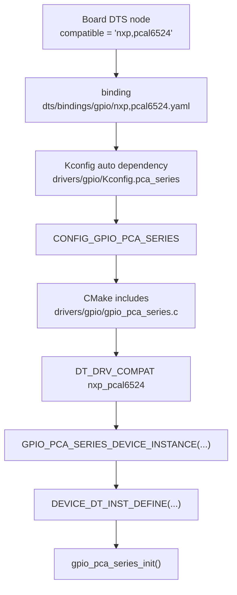
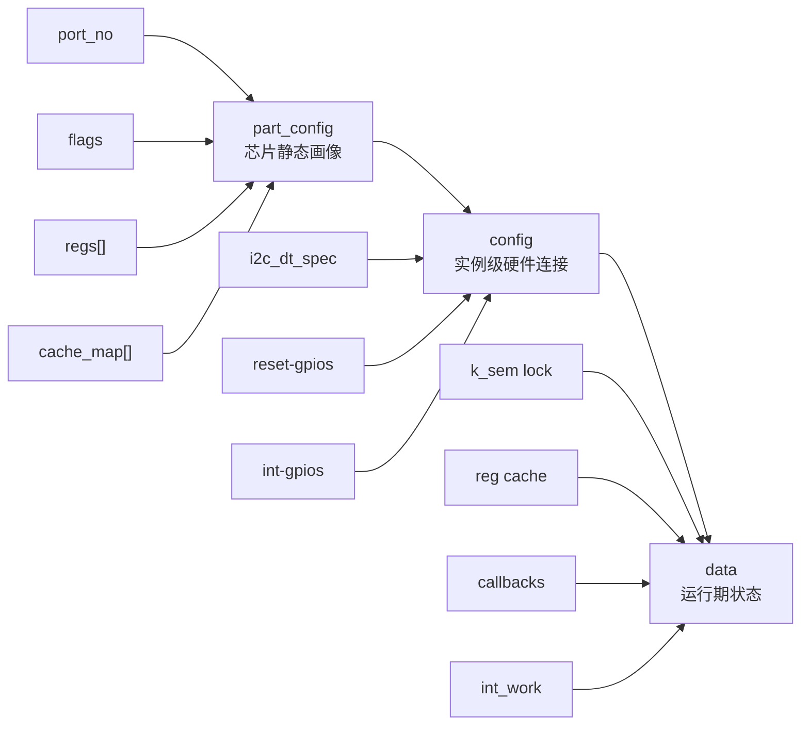
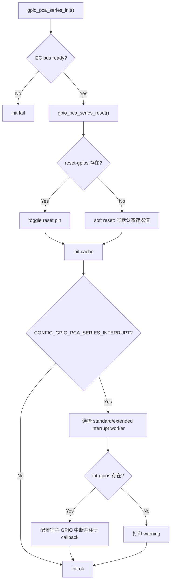
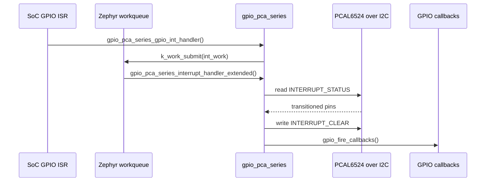

# PCAL6524 Driver Research

## 1. 研究目标

本文针对 Zephyr 中 `PCAL6524` GPIO expander 驱动实现做一次源码级梳理，重点回答下面几个问题：

1. `PCAL6524` 在 Zephyr 里是如何被识别、打开并实例化成设备的。
2. 它和其他 PCA/PCAL 系列芯片共用了哪些框架逻辑。
3. `PCAL6524` 自己的特化点在哪里，尤其是寄存器布局、输入读取和中断路径。
4. 这份实现有哪些值得注意的设计点、限制和潜在问题。

## 2. TL;DR

- `PCAL6524` 没有单独的专用驱动文件，它使用的是通用的 [`drivers/gpio/gpio_pca_series.c`](drivers/gpio/gpio_pca_series.c)。
- `PCAL6524` 的“芯片特化”主要由一份 `part_config` 完成，其中定义了：
  - `port_no = 3`，也就是 24 个 GPIO 分成 3 个 8-bit port。
  - capability flags：`LATCH / PULL / INT_MASK / INT_EXTEND / OUT_CONFIG`。
  - 一组 `reg_type -> register address` 的映射表。
- 因为 `PCAL6524` 带有 `INT_EXTEND` 和 `OUT_CONFIG`，所以它在运行时走的是 **extended API**：
  - 读输入走 `INPUT_STATUS`，不是 `INPUT_PORT`。
  - 中断配置走硬件 `INTERRUPT_EDGE` 寄存器，不依赖软件比较边沿。
  - 中断处理读取 `INTERRUPT_STATUS`，再写 `INTERRUPT_CLEAR` 清除状态。
- 驱动默认启用中断和全量寄存器缓存，对 `PCAL6524` 这类特性较多的器件来说是比较合理的默认值。
- 代码整体是表驱动和能力驱动的风格，但仍然有几个维护点值得留意：
  - API 选择对 `PCAL6524/PCAL6534` 仍是硬编码。
  - 单 pin 配置会整块重写多字节寄存器。
  - `GPIO_SINGLE_ENDED` 语义在实现里基本等价于 open-drain。
  - drive-strength 公开宏的 dt-binding header 里存在一个疑似宏名笔误。

## 3. 关键文件地图

| 角色 | 文件 |
| --- | --- |
| 通用 PCA/PCAL 系列驱动主体 | [`drivers/gpio/gpio_pca_series.c`](drivers/gpio/gpio_pca_series.c) |
| `PCAL6524` binding | [`dts/bindings/gpio/nxp,pcal6524.yaml`](dts/bindings/gpio/nxp,pcal6524.yaml) |
| PCA/PCAL 系列公共 binding | [`dts/bindings/gpio/nxp,pca_series.yaml`](dts/bindings/gpio/nxp,pca_series.yaml) |
| 驱动 Kconfig | [`drivers/gpio/Kconfig.pca_series`](drivers/gpio/Kconfig.pca_series) |
| 扩展 GPIO flag 宏定义 | [`include/zephyr/dt-bindings/gpio/pca-series-gpio.h`](include/zephyr/dt-bindings/gpio/pca-series-gpio.h) |
| 板级 `PCAL6524` DTS 示例 | [`boards/nxp/frdm_imx93/frdm_imx93_mimx9352_a55.dts`](boards/nxp/frdm_imx93/frdm_imx93_mimx9352_a55.dts) |
| 板级 `PCAL6524` DTS 示例 | [`boards/nxp/frdm_imx91/frdm_imx91_mimx9131.dts`](boards/nxp/frdm_imx91/frdm_imx91_mimx9131.dts) |
| 板级 `PCAL6524` DTS 示例 | [`boards/nxp/imx93_evk/imx93_evk_mimx9352_a55.dts`](boards/nxp/imx93_evk/imx93_evk_mimx9352_a55.dts) |
| build-all 覆盖测试节点 | [`tests/drivers/build_all/gpio/app.overlay`](tests/drivers/build_all/gpio/app.overlay) |
| 旧的 `PCAL64xxA` 专用驱动，不适用于 `PCAL6524` | [`drivers/gpio/gpio_pcal64xxa.c`](drivers/gpio/gpio_pcal64xxa.c) |

## 4. 它是怎么被接进 Zephyr 的

[`dts/bindings/gpio/nxp,pcal6524.yaml`](dts/bindings/gpio/nxp,pcal6524.yaml) 只做了很薄的一层定义：

- `compatible = "nxp,pcal6524"`
- `ngpios = 24`
- 其他公共属性都继承自 [`dts/bindings/gpio/nxp,pca_series.yaml`](dts/bindings/gpio/nxp,pca_series.yaml)

公共 binding 里进一步声明了：

- 这是一个 `gpio-controller`
- 它同时也是 `i2c-device`
- 可选属性包括 `reset-gpios` 和 `int-gpios`
- `#gpio-cells = <2>`

`PCAL6524` 从 DTS 到实例化的大致链路如下：



这套链路意味着：

- 只要某个 DTS 节点使用 `compatible = "nxp,pcal6524"`，并且状态为 `okay`，就会触发 `GPIO_PCA_SERIES` 这套驱动。
- 设备实例不是手写出来的，而是靠 [`drivers/gpio/gpio_pca_series.c`](drivers/gpio/gpio_pca_series.c) 末尾那组 `DT_INST_FOREACH_STATUS_OKAY_VARGS(...)` 宏自动展开。

## 5. `PCAL6524` 不是独立驱动，而是通用驱动中的一个 profile

### 5.1 通用框架的核心抽象

[`drivers/gpio/gpio_pca_series.c`](drivers/gpio/gpio_pca_series.c) 的抽象层次非常清晰：

- `struct gpio_pca_series_part_config`
  - 描述某一颗芯片有多少 port、支持哪些能力、每类寄存器对应哪个地址。
- `struct gpio_pca_series_config`
  - 描述某个设备实例的 I2C 连接、reset GPIO、interrupt GPIO。
- `struct gpio_pca_series_data`
  - 描述运行期状态：锁、缓存、中断回调、workqueue。

可以把它理解成下面这张图：



因此，通用驱动的工作方式不是“为每个 compatible 写一套逻辑”，而是：

1. 先定义统一的寄存器类型枚举，比如 `OUTPUT_PORT`、`CONFIGURATION`、`INPUT_STATUS`、`INTERRUPT_EDGE`。
2. 再让每个芯片 profile 告诉框架：这些逻辑寄存器在这颗芯片上分别位于什么地址、有哪些不存在。
3. 统一的 GPIO API 实现根据 capability flag 选择不同分支。

### 5.2 为什么 `PCAL6524` 会走 extended API

在 [`drivers/gpio/gpio_pca_series.c`](drivers/gpio/gpio_pca_series.c) 里，`PCAL6524` 和 `PCAL6534` 被显式分派到 extended API：

- `GPIO_PCA_GET_API_BY_PART_NO(...)` 中：
  - `PCAL6524 -> gpio_pca_series_api_funcs_extended`
  - `PCAL6534 -> gpio_pca_series_api_funcs_extended`
  - 其余大多数型号 -> `gpio_pca_series_api_funcs_standard`

这里的意义是：

- **standard API**
  - 更像传统 PCA/PCAL 芯片。
  - 读输入通常走 `INPUT_PORT`。
  - 中断可能需要软件比较输入变化。
- **extended API**
  - 用于带 `INT_EXTEND` 的器件。
  - 读输入走 `INPUT_STATUS`。
  - 中断边沿选择直接由硬件寄存器保存。
  - 中断状态从 `INTERRUPT_STATUS` 读取，再显式清除。

`PCAL6524` 有 `INT_EXTEND` 和 `OUT_CONFIG`，因此它天然适合 extended 路径。

## 6. `PCAL6524` 的芯片特化内容

`PCAL6524` 对应的特化定义都在 [`drivers/gpio/gpio_pca_series.c`](drivers/gpio/gpio_pca_series.c) 靠后部分。

### 6.1 能力位

`PCAL6524` 使用的是 `GPIO_PCA_SERIES_FLAG_TYPE_3`，包含以下能力：

| flag | 含义 | 对 `PCAL6524` 的影响 |
| --- | --- | --- |
| `PCA_HAS_LATCH` | 支持输入锁存和输出驱动强度 | 可用 `INPUT_LATCH` 和 `OUTPUT_DRIVE_STRENGTH` |
| `PCA_HAS_PULL` | 支持上拉/下拉控制 | 可用 `PULL_ENABLE` 和 `PULL_SELECT` |
| `PCA_HAS_INT_MASK` | 支持中断 mask/status | 可用 `INTERRUPT_MASK` 和 `INTERRUPT_STATUS` |
| `PCA_HAS_INT_EXTEND` | 支持硬件边沿配置和清中断 | 可用 `INTERRUPT_EDGE` 和 `INTERRUPT_CLEAR` |
| `PCA_HAS_OUT_CONFIG` | 支持输出类型配置 | 可用 `OUTPUT_CONFIG`，并使用 `INPUT_STATUS` |

这几个 flag 的组合非常关键，因为后续几乎所有条件分支都以它们为依据。

### 6.2 `PCAL6524` 寄存器画像

`PCAL6524` 的 part config 指定：

- `port_no = 3`
- `regs = gpio_pca_series_reg_pcal6524[]`
- 如果开了 `CONFIG_GPIO_PCA_SERIES_CACHE_ALL`，则使用 `gpio_pca_series_cache_map_pcal65xx[]`

从驱动角度看，`PCAL6524` 的关键寄存器布局如下：

| 逻辑寄存器类型 | 地址 | 每 port 字节数 | 24-pin 总长度 | cache | 说明 |
| --- | --- | --- | --- | --- | --- |
| `INPUT_PORT` | 不使用 | 1 | 3 | 否 | 因为 `PCAL6524` 走 `INPUT_STATUS` |
| `OUTPUT_PORT` | `0x04` | 1 | 3 | 是 | 输出电平 |
| `CONFIGURATION` | `0x0c` | 1 | 3 | 是 | 方向寄存器，1=input，0=output |
| `OUTPUT_DRIVE_STRENGTH` | `0x40` | 2 | 6 | 是 | 每 pin 两个 bit |
| `INPUT_LATCH` | `0x48` | 1 | 3 | 否 | 输入锁存控制 |
| `PULL_ENABLE` | `0x4c` | 1 | 3 | 是 | 使能上下拉 |
| `PULL_SELECT` | `0x50` | 1 | 3 | 是 | 选择上拉/下拉 |
| `INTERRUPT_MASK` | `0x54` | 1 | 3 | 是 | 1=mask，0=enable |
| `INTERRUPT_STATUS` | `0x58` | 1 | 3 | 否 | 中断状态 |
| `INTERRUPT_EDGE` | `0x60` | 2 | 6 | 是 | 每 pin 两个 bit 选择边沿模式 |
| `INTERRUPT_CLEAR` | `0x68` | 1 | 3 | 否 | 写 1 清中断 |
| `INPUT_STATUS` | `0x6c` | 1 | 3 | 否 | 读取实际输入状态 |
| `OUTPUT_CONFIG` | `0x70` | 1 | 3 | 是 | 输出类型配置，驱动中用于 push-pull/open-drain |

有两个实现层面很值得注意：

1. 由于 `port_no = 3`，所以所有 1-byte-per-port 寄存器都会一次性读写 3 字节。
2. `OUTPUT_DRIVE_STRENGTH` 和 `INTERRUPT_EDGE` 是 2-byte-per-port，因此会一次性读写 6 字节。

也就是说，驱动内部虽然用的是统一的 `uint32_t/uint64_t` 暂存值，但它实际是在操作 24-bit 或 48-bit 的片上寄存器布局。

## 7. 初始化路径

初始化函数是 [`drivers/gpio/gpio_pca_series.c`](drivers/gpio/gpio_pca_series.c) 里的 `gpio_pca_series_init()`。

它的核心流程如下：



### 7.1 reset 行为

`gpio_pca_series_reset()` 的设计是：

- 如果 DTS 提供了 `reset-gpios`，优先尝试硬件 reset。
- 硬件 reset 失败时，退回到 soft reset。
- 如果没有 `reset-gpios`，直接走 soft reset。

soft reset 的实现不是一个真正的芯片内部 reset 命令，而是手工把若干寄存器写到默认值，例如：

- `OUTPUT_PORT = 0xff`
- `CONFIGURATION = 0xff`
- `OUTPUT_DRIVE_STRENGTH = 0xff`
- `INPUT_LATCH = 0x00`
- `PULL_ENABLE = 0x00`
- `PULL_SELECT = 0xff`
- `OUTPUT_CONFIG = 0x00`
- `INTERRUPT_MASK = 0xff`
- `INTERRUPT_EDGE = 0x00`

这意味着在不接 reset pin 的板子上，驱动启动时仍然会强行把设备拉回一组“软件约定的复位态”。

### 7.2 cache 初始化

默认开启 `CONFIG_GPIO_PCA_SERIES_CACHE_ALL` 时，驱动会在启动阶段把可缓存寄存器全部读一遍，填进 RAM cache。

对 `PCAL6524` 来说，这一步比较重要，因为它后续很多配置和输出逻辑都依赖 cache 进行 read-modify-write。

`PCAL6524` 这类 extended 器件的 cache 特征是：

- `OUTPUT_PORT`、`CONFIGURATION`、`PULL_ENABLE`、`PULL_SELECT`、`OUTPUT_CONFIG`、`INTERRUPT_MASK`、`INTERRUPT_EDGE` 都会缓存。
- `INPUT_STATUS`、`INTERRUPT_STATUS`、`INTERRUPT_CLEAR` 不缓存。
- 它不像 standard 中断路径那样需要伪造 `input_history` / `interrupt_rise` / `interrupt_fall` 这类软件缓存寄存器。

## 8. GPIO 配置和读写行为

### 8.1 `pin_configure()`

`PCAL6524` 的 `pin_configure()` 不是简单改一个方向位，而是会按 flag 分几步工作：

1. 检查输入输出模式是否合法。
2. 如果请求了 `GPIO_SINGLE_ENDED`，并且器件支持 `OUT_CONFIG`，则修改 `OUTPUT_CONFIG`。
3. 如果请求了 `GPIO_PULL_UP` / `GPIO_PULL_DOWN`，则更新：
   - `PULL_SELECT`
   - `PULL_ENABLE`
4. 如果请求了 PCA-series 扩展 drive strength flag，则更新 `OUTPUT_DRIVE_STRENGTH`。
5. 如果请求了 `GPIO_OUTPUT_INIT_HIGH/LOW`，则修改 `OUTPUT_PORT`。
6. 最后再写 `CONFIGURATION`，设置 pin 为输入或输出。

从顺序上看，这样做有两个优点：

- 先写输出值、再切方向，能减少切到输出瞬间的毛刺风险。
- 所有配置都在一个锁里完成，避免并发打架。

### 8.2 `GPIO_SINGLE_ENDED` 的实现语义

对 `PCAL6524` 来说，`GPIO_SINGLE_ENDED` 最终会映射到 `OUTPUT_CONFIG` 的某一位：

- bit = 1：open-drain
- bit = 0：push-pull

实现上只检查了 `GPIO_SINGLE_ENDED`，没有继续区分 open-drain 和 open-source。换句话说，当前驱动把“single-ended”基本等价看作“open-drain”。

### 8.3 输入读取为什么走 `INPUT_STATUS`

`PCAL6524` 读输入走的是 `gpio_pca_series_port_read_extended()`，它读取的是 `INPUT_STATUS`。

这是和 standard 路径最大的区别之一。

这种做法的好处是：

- 不会复用 standard 路径里 `INPUT_PORT` 的那套副作用假设。
- 更贴合 `PCAL6524` 这种带扩展中断控制的芯片。

### 8.4 输出写入

输出写入路径是：

1. 从 cache 取出 `OUTPUT_PORT` 当前值。
2. 按 `mask/value/toggle` 算出新的输出值。
3. 整块写回 `OUTPUT_PORT`。
4. cache 跟着更新。

因此，哪怕只是改一个 pin，当前驱动也是整 3 字节读改写，不是单 byte 或单 bit 写。

## 9. 中断路径

`PCAL6524` 的中断实现是本驱动最值得关注的部分之一，因为它和 standard PCA/PCAL 设备明显不同。

### 9.1 中断配置

`gpio_pca_series_pin_interrupt_configure_extended()` 的逻辑是：

1. 从 cache 读出 `INTERRUPT_EDGE` 和 `INTERRUPT_MASK`。
2. 根据 Zephyr 的 `GPIO_INT_TRIG_HIGH/LOW/BOTH`，把每个 pin 对应的 2-bit edge mode 写入 `INTERRUPT_EDGE`。
3. 为了避免丢中断，把 `INPUT_LATCH` 也按 `~int_mask` 同步配置。
4. 更新 `INTERRUPT_MASK`。

这里的设计说明 `PCAL6524` 的中断不是完全依赖软件比较输入变化，而是明确使用了硬件边沿寄存器。

### 9.2 中断触发和清除

实际中断处理路径如下：



这个实现有几个关键点：

- 宿主 SoC GPIO ISR 本身不做 I2C，只负责把工作丢给 workqueue。
- 真正的设备中断状态读取和清除发生在线程上下文里。
- 这符合 I2C 不能在 ISR 里随便做事务的约束。

### 9.3 为什么这是 extended 路径

和 standard 路径对比：

- standard 路径通常需要软件缓存上一次输入值，再做边沿比较。
- extended 路径直接用硬件的：
  - `INTERRUPT_EDGE`
  - `INTERRUPT_STATUS`
  - `INTERRUPT_CLEAR`

这让 `PCAL6524` 的中断配置更接近“硬件声明式”，而不是“软件模拟式”。

## 10. DTS、板级接法和测试现状

### 10.1 板级 DTS 示例

几个板级 DTS 都已经把 `PCAL6524` 接进来了，例如：

- [`boards/nxp/frdm_imx93/frdm_imx93_mimx9352_a55.dts`](boards/nxp/frdm_imx93/frdm_imx93_mimx9352_a55.dts)
- [`boards/nxp/frdm_imx91/frdm_imx91_mimx9131.dts`](boards/nxp/frdm_imx91/frdm_imx91_mimx9131.dts)
- [`boards/nxp/imx93_evk/imx93_evk_mimx9352_a55.dts`](boards/nxp/imx93_evk/imx93_evk_mimx9352_a55.dts)

这些节点通常长这样：

```dts
gpio_exp0: pcal6524@22 {
    compatible = "nxp,pcal6524";
    reg = <0x22>;
    gpio-controller;
    #gpio-cells = <2>;
    ngpios = <24>;
    int-gpios = <&gpio3 27 (GPIO_ACTIVE_LOW | GPIO_PULL_UP)>;
    status = "okay";
};
```

可以看到这些板级节点多数只接了 `int-gpios`，没有接 `reset-gpios`。这也意味着驱动启动时大概率会走 soft reset。

### 10.2 build-all 测试

[`tests/drivers/build_all/gpio/app.overlay`](tests/drivers/build_all/gpio/app.overlay) 中包含了 `pcal6524` 节点，说明这颗芯片至少被纳入了编译覆盖：

- `compatible = "nxp,pcal6524"`
- `ngpios = <24>`
- 同时提供了 `int-gpios` 和 `reset-gpios`

但目前我没有在仓库里看到专门针对以下行为的运行时测试：

- `INPUT_STATUS` 读取语义
- `OUTPUT_CONFIG` 的 open-drain / push-pull 配置
- `INTERRUPT_EDGE` 的硬件边沿配置
- `INTERRUPT_STATUS / INTERRUPT_CLEAR` 的实际行为

所以这份研究中关于行为层的判断主要来自静态代码分析，而不是专门的功能测试结果。

## 11. 和旧 `PCAL64XXA` 驱动的关系

仓库里还有一份 [`drivers/gpio/gpio_pcal64xxa.c`](drivers/gpio/gpio_pcal64xxa.c)，但它适用的是：

- `nxp,pcal6408a`
- `nxp,pcal6416a`

不要把它和 `PCAL6524` 混在一起。

两者的关系可以概括成：

- `gpio_pcal64xxa.c`
  - 老的、更专用的实现
  - 针对 `PCAL6408A/6416A`
- `gpio_pca_series.c`
  - 新的、更通用的系列驱动
  - 把 `PCA953x / PCA955x / PCAL953x / PCAL64xx / PCAL65xx` 都放进同一框架

`PCAL6524` 明确属于后者。

## 12. 值得注意的实现细节和潜在问题

### 12.1 API 选择对 `PCAL6524` 仍然是硬编码

虽然驱动已经有一套 capability flag 体系，但 “走 standard 还是 extended API” 这一层仍然在 [`drivers/gpio/gpio_pca_series.c`](drivers/gpio/gpio_pca_series.c) 里按 part number 硬编码选择。

这意味着以后如果再接入一个同样支持 `INT_EXTEND` 的新型号，开发者除了要补：

- compatible
- reg map
- cache map
- part config

还必须记得同步修改 API 分派宏，否则行为会错。

### 12.2 单 pin 配置仍会整块写多字节寄存器

源码里已经有 TODO 指出这一点：

- `pin_configure()`
- `pin_interrupt_configure()`

都不是只改一个 byte，而是先从 cache 读整个逻辑寄存器，再把整块写回。

对 `PCAL6524` 来说，这通常意味着：

- 1-byte-per-port 寄存器：一次 3 字节写回
- 2-byte-per-port 寄存器：一次 6 字节写回

这不一定错，但会带来：

- I2C 带宽开销更大
- 并发配置时对 cache 正确性的依赖更强

### 12.3 `GPIO_SINGLE_ENDED` 基本被当作 open-drain

当前实现只检查 `GPIO_SINGLE_ENDED` 是否存在，然后直接写 `OUTPUT_CONFIG` 的位来切换输出类型。

它没有继续检查 open-source 和 open-drain 的差异，因此语义上更接近：

- 有 `GPIO_SINGLE_ENDED` -> open-drain
- 没有 `GPIO_SINGLE_ENDED` -> push-pull

如果上层未来希望严格表达 open-source，这里可能需要进一步澄清。

### 12.4 dt-binding header 里 drive-strength 宏疑似有笔误

[`include/zephyr/dt-bindings/gpio/pca-series-gpio.h`](include/zephyr/dt-bindings/gpio/pca-series-gpio.h) 里定义了：

- `PCA_SERIES_GPIO_DRIVE_STRENGTH_CONFIG_POS`
- `PCA_SERIES_GPIO_DRIVE_STRENGTH_ENABLE_POS`

但下面公开的便捷宏：

- `PCA_SERIES_GPIO_DRIVE_STRENGTH_X1`
- `PCA_SERIES_GPIO_DRIVE_STRENGTH_X2`
- `PCA_SERIES_GPIO_DRIVE_STRENGTH_X3`
- `PCA_SERIES_GPIO_DRIVE_STRENGTH_X4`

使用的却是 `PCA_SERIES_GPIO_DRIVE_STRENGTH_POS`，这个名字在文件中并没有定义。

这看起来非常像是应该使用 `..._CONFIG_POS` 却写错了名字。驱动内部解析 flag 的宏是对的，但如果外部要直接使用这些便捷常量，可能会踩到这个问题。

### 12.5 `gpio_pca_series_part_name[]` 和 enum 已经不同步

[`drivers/gpio/gpio_pca_series.c`](drivers/gpio/gpio_pca_series.c) 里 `enum gpio_pca_series_part_no` 包含：

- `PCA6408`
- `PCA6416`
- `PCAL6408`
- `PCAL6416`

但 `gpio_pca_series_part_name[]` 里少了几项，顺序已经不再完全对应 enum。

目前我没有看到这个数组被实际使用，所以暂时不像功能 bug，更像一个已经失去维护同步的 debug 遗留物。

## 13. 研究结论

如果只用一句话概括：**Zephyr 对 `PCAL6524` 的支持是“通用框架 + 芯片画像”的实现方式，而不是单独为它写了一套驱动逻辑。**

这份实现的优点是：

- 框架复用度高
- 新型号接入成本低
- `PCAL6524` 的高级特性，中断扩展、输出类型、驱动强度、上下拉都能纳入统一 GPIO API

这份实现的主要风险点是：

- 一些关键分支仍有硬编码痕迹
- 单 pin 改配置的写粒度偏粗
- 行为正确性较依赖 cache
- `PCAL6524` 特有路径缺少明显的运行时验证覆盖

如果后续要继续深入，我建议按下面三个方向继续看：

1. 对照 `PCAL6524` datasheet 逐项核对 `gpio_pca_series_reg_pcal6524[]` 的地址表是否完全正确。
2. 在真实硬件上验证 `INTERRUPT_EDGE / INTERRUPT_STATUS / INTERRUPT_CLEAR` 的时序和边沿行为。
3. 检查 `pca-series-gpio.h` 中 drive-strength 宏名问题是否已经影响到任何 board overlay 或 sample。
